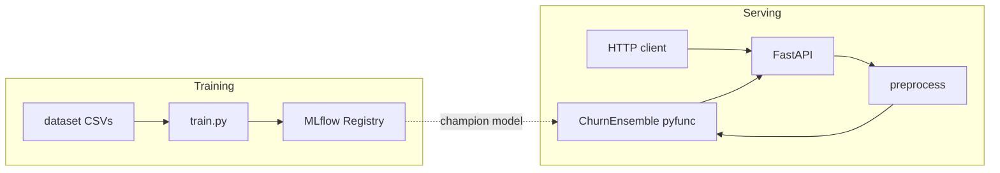

# Artificial Intelligence (HSLU)

Coursework and project work for **HSLU Artificial Intelligence**. The main deliverable is a **Customer Churn Prediction** stack under [`project/`](project/): a **LightGBM + XGBoost** ensemble (5-fold stratified cross-validation), **Optuna** hyperparameter optimization, **MLflow** experiment tracking and Model Registry, and a **FastAPI** service for real-time inference on telecom-style tabular data.

The repository root [`main.py`](main.py) is a minimal placeholder. Smaller exercises live under [`lessons/`](lessons/) (for example [`lessons/sw_03/web_service.py`](lessons/sw_03/web_service.py)). [`dashboard.html`](dashboard.html) is a standalone static “MLOps blueprint” page (Tailwind CSS, Chart.js); it is not part of the Python runtime.

## Tech stack

| Area | Notes |
|------|--------|
| Runtime | Python **3.13+** (see [`.python-version`](.python-version)) |
| Packaging | [`uv`](https://docs.astral.sh/uv/) with [`pyproject.toml`](pyproject.toml) and [`uv.lock`](uv.lock) |
| ML | LightGBM, XGBoost, scikit-learn, pandas, NumPy, seaborn, joblib |
| Training | Optuna (HPO), MLflow (tracking + registry) |
| Serving | FastAPI, Pydantic ([`project/schemas/`](project/schemas/schemas.py)) |
| Orchestration | [Prefect](https://www.prefect.io/) is listed as a dependency; the main training path is [`project/train.py`](project/train.py) |

Install dependencies from the repository root:

```bash
uv sync
```

## Repository layout

| Path | Role |
|------|------|
| [`project/train.py`](project/train.py) | End-to-end training: load data → feature engineering → Optuna → CV ensemble → register `CustomerChurnEnsemble` → `submission.csv` |
| [`project/web_service.py`](project/web_service.py) | FastAPI app; loads `models:/CustomerChurnEnsemble@champion` from MLflow |
| [`project/schemas/`](project/schemas/) | Pydantic request and response models |
| [`project/docker-compose.yml`](project/docker-compose.yml) | API on port **8000** and MLflow on **5001** |
| [`project/docs/`](project/docs/) | Deep dives: [TRAIN.md](project/docs/TRAIN.md), [WEB_SERVICE.md](project/docs/WEB_SERVICE.md), [SCHEMAS.md](project/docs/SCHEMAS.md) |
| [`project/customer-churn-eda-multimodelensemble.ipynb`](project/customer-churn-eda-multimodelensemble.ipynb) | EDA and exploratory modeling |

## Data

Place your course or competition CSVs under **`project/dataset/`**:

- `project/dataset/train.csv`
- `project/dataset/test.csv`

The `dataset/` directory is gitignored ([`.gitignore`](.gitignore)); do not commit raw data.

## Training (MLflow + `train.py`)

Training expects an MLflow server compatible with the URI configured in [`project/train.py`](project/train.py) (currently **`http://localhost:5001`** for both tracking and registry). Start MLflow on that port, then run:

```bash
uv run python project/train.py
```

Typical outputs and artifacts (details in [TRAIN.md](project/docs/TRAIN.md)):

- Registered model name **`CustomerChurnEnsemble`**, with alias **`champion`** when promoted
- **`project/submission.csv`** (test predictions)
- **`project/optuna_studies.db`** (Optuna studies)
- Metrics and artifacts in MLflow (artifact root as configured on the server)

### Docker Compose (MLflow + API)

From `project/`:

```bash
cd project && docker compose up --build
```

- MLflow UI / API: **http://localhost:5001**
- FastAPI: **http://localhost:8000** (sets `MLFLOW_TRACKING_URI=http://mlflow:5001` for the API container)

## Running the API locally

Imports use `from schemas.schemas import …`, so the app must be run with **`project/`** on `PYTHONPATH`, or from inside **`project/`**.

**Option A — change into `project/` (recommended):**

```bash
cd project
uv run uvicorn web_service:app --reload --host 0.0.0.0 --port 8000
```

**Option B — from the repository root:**

```bash
PYTHONPATH=project uv run uvicorn web_service:app --reload --host 0.0.0.0 --port 8000
```

Set **`MLFLOW_TRACKING_URI`** if your MLflow server is not the default for your environment (for example `http://localhost:5001` when the API runs on the host and MLflow is exposed on that port). The service loads **`CustomerChurnEnsemble@champion`** at startup; run `train.py` against the same registry first.

Interactive API docs: **http://localhost:8000/docs** (Swagger) and **http://localhost:8000/redoc**.

| Method | Path | Purpose |
|--------|------|---------|
| `GET` | `/` | Health / info |
| `POST` | `/predict` | Single customer prediction |
| `POST` | `/predict/batch` | Batch predictions |
| `GET` | `/model/info` | Model metadata |

Request and response fields are documented in [SCHEMAS.md](project/docs/SCHEMAS.md).

## Environment variables

| Variable | Used by | Purpose |
|----------|---------|---------|
| `MLFLOW_TRACKING_URI` | [`project/web_service.py`](project/web_service.py) | MLflow server for registry and artifacts when loading the model (optional if the default file-based URI matches your setup) |

Training currently sets the tracking URI in code; align your MLflow deployment or edit [`train.py`](project/train.py) if you use a different host or port.

## Architecture (high level)



## Development

Formatting and linting: [Ruff](https://docs.astral.sh/ruff/) is available via the project environment, for example:

```bash
uv run ruff check .
uv run ruff format .
```

## Further reading

- [Training pipeline](project/docs/TRAIN.md) — functions, constants, HPO spaces, CV, registration
- [Web service](project/docs/WEB_SERVICE.md) — endpoints, preprocessing parity with training, Docker path handling
- [Pydantic schemas](project/docs/SCHEMAS.md) — enums and request/response models
